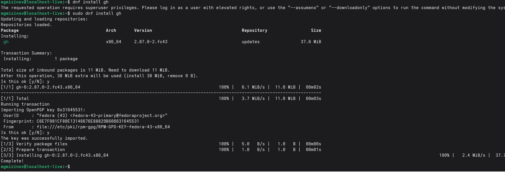
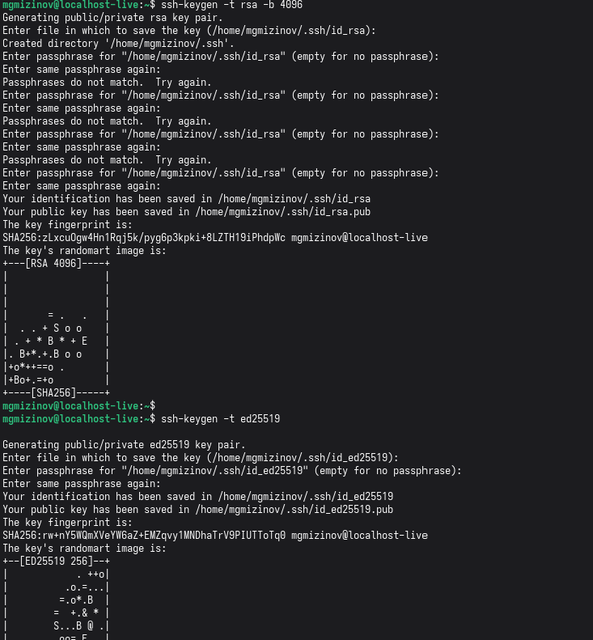
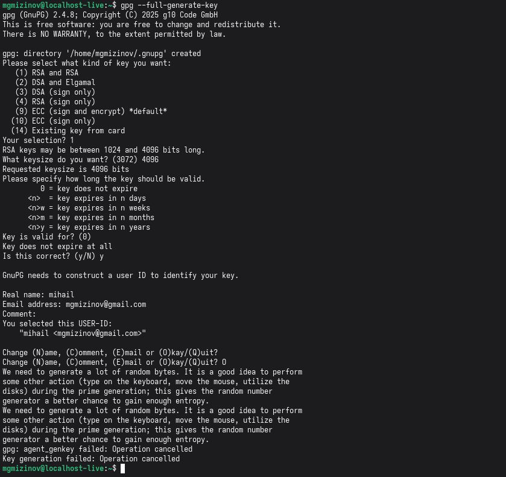
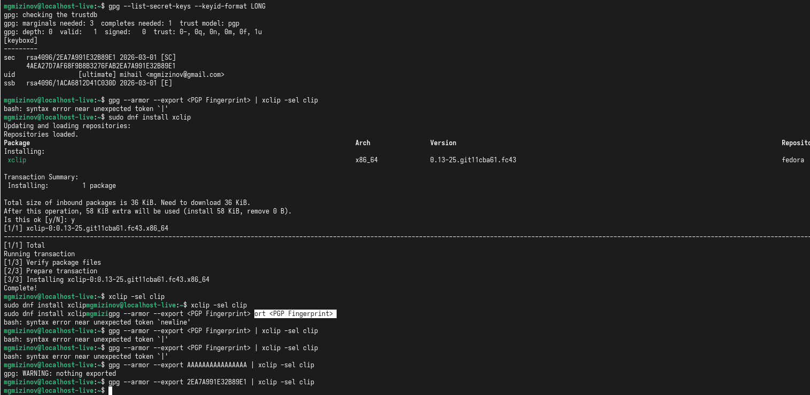
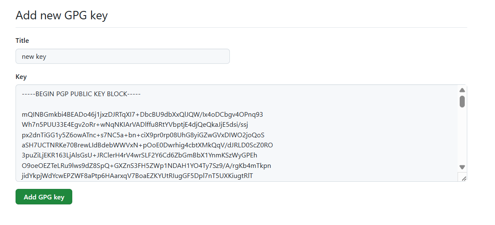
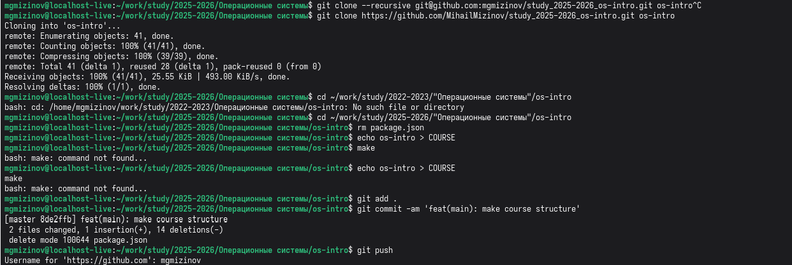

<b>
Лабораторная работа 2
</b>
<b>
Выполнил Мизинов Михаил НКАбд-04-25
</b>

<b>  Цель работы</b>

Изучить идеологию и применение средств контроля версий.
Освоить умения по работе с git.

<b>Выполнение работы</b>

Установка git и gh.

Риcунок 1 - Установка git и gh

Завершили базовую настройку git

Риcунок 2 - Завершение базовой настройки git

Установили ssh ключи

Риcунок 3 - ssh ключи

Создание ключа pgp

Риcунок 4 - pgp ключ

Добавление PGP ключа в GitHub

Риcунок 5 - pgp ключ копирование

Риcунок 6 - pgp ключ добавление в git

Настройка автоматических подписей коммитов git

Риcунок 7 - автоматические подписи

Сознание репозитория курса на основе шаблона и настройка каталога курса

Риcунок 8 - редактирование репозитория

<b>  Выводы</b>

Изучил идеологию и применение средств контроля версий.
Освоил умения по работе с git.
